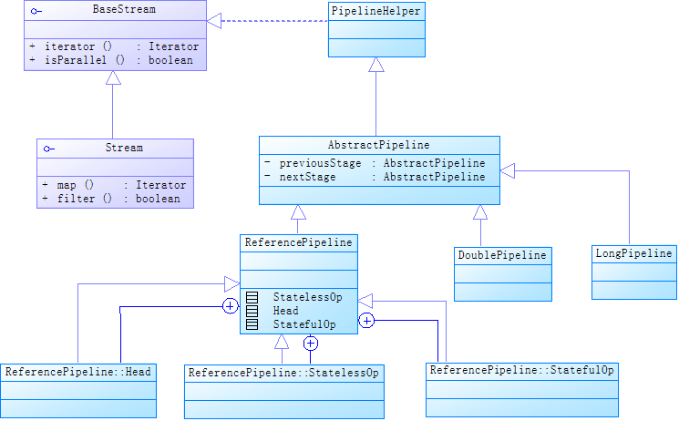
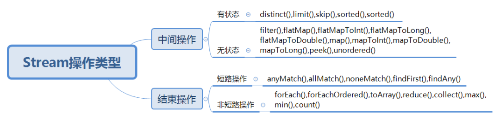
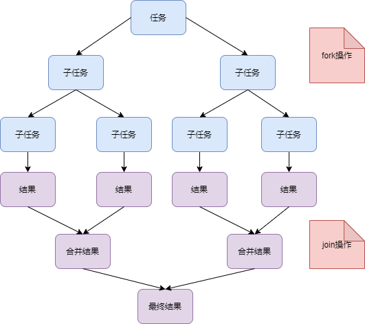

## Stream
### Stream 底层原理


这个类图说明以下几点：
- AbstractPipeline有基本类型的子类，如LongPipeline和DoublePipeline，还有一个引用类型的子类ReferencePipeline。
- 无论是ReferencePipeline，还是LongPipeline和DoublePipeline等基本类型的Pipeline，都有3个内部类来继承自己。
- StatelessOp对应无状态的操作，StatefulOp对应有状态的操作，Head对应Collection.stream()方法返回结果。
- 无论是StatelessOp、StatefulOp还是Head，都是一个Pipeline，这些Pipeline用双向链表串联起来，每个Pipeline节点被看作一个Stage，Head是链表的头结点。上面UML类图中AbstractPipeline类中previousStage和nextStage就代表双向链表当前节点指向前后节点的引用。如下图：


### 面试官：上面用双向链表把所有操作都串联起来了，这样可以实现从Head节点开始依次执行所有的操作。但是这些操作怎么叠加在一起呢？比如下面这段代码有三个map方法，后面的方法要依赖前面的计算结果：

```
List<Integer> list = Arrays.asList(5, 2, 3, 1, 4);
List<Integer> newArray = list.stream().map(StreamTest2::map1).map(StreamTest2::map2).map(StreamTest2::map3).collect(Collectors.toList());
```

Stream提供了Sink接口来处理操作的叠加。上面代码的map方法把操作封装到了Sink，每个节点执行操作时，调用Sink的accept方法就可以把操作结果传给下一个节点的Sink。比如map方法源代码如下：

```
public final <R> Stream<R> map(Function<? super P_OUT, ? extends R> mapper) {
    Objects.requireNonNull(mapper);
    return new StatelessOp<P_OUT, R>(this, StreamShape.REFERENCE,
                                 StreamOpFlag.NOT_SORTED | StreamOpFlag.NOT_DISTINCT) {
        @Override
  //返回包装成的Sink
        Sink<P_OUT> opWrapSink(int flags, Sink<R> sink) {
            return new Sink.ChainedReference<P_OUT, R>(sink) {
                @Override
                public void accept(P_OUT u) {
        //downstream是下游节点的Sink，把当前节点的执行结果传给下游节点
                    downstream.accept(mapper.apply(u));
                }
            };
        }
    };
}
```

### Sink接口
Sink主要提供了下面4个方法, 对于有状态的操作，必须实现begin和end两个方法，因为begin方法会创建一个存放中间结果的容器，accept方法将元素放入该容器，end方法负责对容器中元素处理，比如排序。
```
//执行操作之前调用这个方法
void begin(long size)
//执行操作之后调用这个方法
void end()
//是否可以结束操作
boolean cancellationRequested()
//操作执行函数
void accept()
```

### 那cancellationRequested方法什么时候用呢？
这个方法用于短路操作，比如stream.findAny。
### 你刚刚提到短路操作，怎么区分短路操作和非短路操作呢？
短路操作和非短路操作都是Stream的结束操作，结束操作是针对中间操作来说的。
短路操作是指不用处理全部元素就可以结束，包括下面的方法：
```
anyMatch(),allMatch(),noneMatch(),findFirst(),findAny()
```
非短路操作是指需要处理所有元素才能结束，包括下面的方法：
```
forEach(),forEachOrdered(),toArray(),reduce(),collect(),max(),min(),count()
```
### 总结一下Stream操作，如下图：


这样从Head节点开始依次调用每个节点封装的Sink中的begin,accept,cancellationRequested,end 四个方法就可以完成Steam流水线的执行。
### 上面提到了Sink会串成一个链，那对于有返回结果的操作，返回的结果是保存在什么地方呢？
这里分三种情况：
- 如果返回结果是boolean(比如 anyMatch、allMatch、noneMatch)和Optional(比如 findFirst、findAny)，返回结果存放在对应的Sink。
- collect, reduce等规约操作，返回结果存放在用户指定的容器中，比如如下代码返回结果放在Optional容器中：
```
Optional accResult = Stream.of(1, 2, 3, 4, 5).reduce((sum, item) -> {
sum += item;
return sum;
});
```
max 和 min也是规约操作，因为底层是通过调用 reduce 方法实现的。
- 对于返回是数组的情况，返回数组之前，数据会存放在一种多叉树数据结构中，这种多叉树结构元素存储在树的叶子当中，一个叶子节点可以存放多个元素。
### 上面你提到返回数组的时候用到了多叉树的结构，这样做对于Stream处理有什么好处呢？
按照官方的说法，这样做是为了避免在并行操作期间不必要地复制数据。
### 能简单介绍一下Stream的并行处理吗？
Stream的并行处理用到了Fork/Join框架，如下图：

计算过程中，先把任务拆解成子任务，并行计算。计算完成后再把子任务计算结果合并成结果集。
### Fork/Join框架跟普通线程池相比，有什么优势吗？
fork/join框架的优势是, 如果某个子任务需要等待另外一个子任务完成才能继续工作，那么处理线程会主动寻找其他未完成的子任务进行执行。跟普通线程池相比，减少了等待时间。
### 使用Stream并行流，一定会比串行快吗？
这个不一定，使用的时候要考虑以下几个因素：
- 要处理的元素数量，数据越多，性能提升越明显。
- 数据结构的可分割性，数组、ArrayList支持随机读取，可分割性好，HashSet、TreeSet虽然可以分割，但不太容易分割均匀，LinkedList、Streams.iterate、BufferedReader.lines因为长度未知，可分解性差。
- 尽量使用基本类型，避免装箱拆箱。
- 单个子任务花费时间越长，带来的性能提升就会越大。
### 据说Stream api跟普通迭代相比有性能损耗，你怎么看？
对于简单的处理操作，Stream api性能确实不如普通迭代。但是如果CPU性能好的话，使用Stream并行处理性能会明细提高。对于复杂处理操作，无论并行还是串行，Stream api有明显的优势。