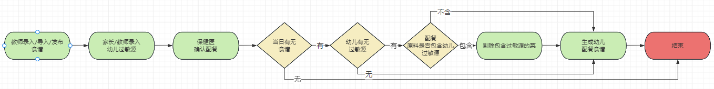

# 简历

## 个人信息

<table align="center" style="word-break: keep-all;word-wrap:break-word;">
<tr>
    <td>姓名</td>
    <td>党未福</td>
    <td>工作年限</td>
    <td>5年</td></tr>
<tr>
    <td>教育经历</td>
    <td>荆楚理工学院(2013.9~2017.7)</td>
    <td>学历</td>
    <td>本科</td></tr>
<tr>
    <td>联系方式</td>
    <td>17319122827</td>
    <td>个人邮箱</td>
    <td>m13886933623@163.com</td>
</tr>
<tr>
    <td>出生日期</td>
    <td>1995.04.08</td>
    <td>性别</td>
    <td>男</td></tr>
</table>

## 技术栈

[//]: # (【熟悉程度（了解、熟悉、掌握、精通）】【技术点（关键字）】【技术核心点（能干嘛）】【解决的问题（干了啥）】)
```text
熟练掌握 JavaEE基础知识，掌握多线程、线程池、锁与并发编程、常用设计模式（工厂、代理、单例、策略、责任链等）、
        反射、自定义注解、泛型等的使用
熟练掌握 JVM内存模型、类加载机制、垃圾回收
熟练掌握 TCP、UDP、HTTP以及HTTPS通信协议及其原理
熟练使用 JavaScript、JQuery、HTML+CSS、Ajax、Servlet、Jsp等Web客户端技术
熟练使用 MySQL、Oracle等关系型数据库，熟练使用Redis、MongoDB、ElasticSearch等非关系型数据库
熟练使用 RPC框架Dubbo
熟练使用 RocketMQ，降低服务耦合实现分布式事务的最终一致性，了解RabbitMQ、ActiveMQ、Kafka
熟练使用 Spring、Mybatis、SpringBoot等开源框架，熟悉Spring的IOC、DI、AOP设计思想和自动装配
熟练使用 Docker，能够使用Harbor搭建私有Docker镜像仓库，编写DockerFile打包生成Docker镜像并上传，了解Docker Compose
熟练使用 Linux常用命令、项目部署、熟悉docker、能够使用Docker搭建Maven私服、GitLab私服等
熟悉 JVM常用调优参数及其作用、常用监控工具；能够通过多种方式导出JVM堆快照，并使用MAT分析快照文件定位解决线上问题
熟悉 MySQL主从复制原理、读写分离、分库分表（Mycat），ShardingJdbc、MySQL索引、SQL优化
熟悉 Restfull API开发规范、熟悉三方授权OAuth2协议、JWT协议
熟悉 SkyWalking链路追踪
了解 网络通信技术Socket、NIO、Netty
了解 第三方支付接口、微信公众号对接流程
了解 SpringCloud常用组件注册中心（Eureka|Nacos）、负载均衡器（Ribbon）、服务保护（Hystrix）、网关（Zuul）、
    分布式配置中心（Nacos、Apollo）、链路追踪（Zipkin）、消息总线（Bus）
```
[//]: # (网络通信协议？)
[//]: # (通信方式？)
[//]: # (数据格式？)
[//]: # (熟悉Nginx，配置反向代理)
[//]: # (？实现七层Http和四层tcp负载均衡、故障转移、rewrite重写机制)
[//]: # (？Consul+upsvnc+Nginx实现动态配置负载均衡)
[//]: # (？了解lvs+keepalived+nginx实现高可用负载集群)
[//]: # (熟知分布式常见问题及解决方案，如分布式任务调度（？）、服务追踪与调用链路（？）、分布式Session一致性（？）、)
[//]: # (分布式事务（Seata）、分布式锁（？）、分布式日志收集（ELK）、分布式生成全局ID（雪花算法）)

## 项目
### 项目名称：7kid平台
### 项目时间：2020年12月~至今
### 项目使用技术：Nacos、Springboot、Mybatis-plus、Redis、MySQL、RocketMQ、Dubbo、Docker、Nginx、Vue、SkyWalking
### 项目简介：
本项目是为幼儿园提供的幼教与家校互动平台，客户端主要有园所后台、7kid教师端、7kid家长端、运营后台。
业务模块主要有以下18个，其中我独立全权负责的模块有5个（园务中心、保健中心、家园共育中心、访客中心、巡检中心）：
- 园务中心，主要包括以下几点：
  - 园所内年级班级的开班、升班、毕业以及毕业后相关业务数据的归档

  - 教职工的入职、角色岗位分配、日常操作、账号禁用、离职、调岗等管理

  - 幼儿的入园、离园、毕业、调班等一系列的管理

- 保育保健中心，主要包括以下几点：
  - 幼儿过敏源、既往史以及各种已知疾病的预防，幼儿日配餐食谱管理等

  - 幼儿身心健康的检查、记录，以国际幼儿健康发育标志作为评判依据对幼儿做一系列的健康评估，并评估结果作为依据对幼儿提出相应的医疗、教育、培养等可行性方案并与家长告知、商榷共同打造优良的教培环境
  - 记录、统计幼儿的健康情况，从多个维度测评幼儿发育情况并生成对应的统计报表
- 家园共育中心，主要包括以下几点：
  - (园所通知、智能相册、班级圈、亲子活动、智能接送)：主要包括家校互动
  - 家校互动相关信息的记录、评论、分享
  - 校园活动的在线参与、提交并在学期末形成幼儿成长记录档案
  - 使用手环、门禁、人脸识别等多种技术手段实现家长智能接送幼儿，家庭管理员可以在线管理接送人员，录入接送人员的人脸等身份信息方便园方快捷核对接送人，打造安全可靠的接送服务
- 访客中心，主要是针对到访人员做的一系列的申请/邀请、到访接待、到/离园信息核对、保安二维码识别核查，打造自主化、自动化访客接待服务
- 巡检中心，主要是为打造安全、优良的教培环境，给园方保卫执勤人员提供的一套巡视巡查任务分配、指派、执行、提交、异常处理系统
- 档案中心 、角色权限中心 教学中心、内容监管中心 财务中心 、帮助中心 、运营管理 、品牌宣传 、系统官网 、OA审批
- 数字驾驶舱 、智慧环境中心(考勤机、闸机、手环、晨检枪、区角观察、视频监控)、考勤中心(教职工、幼儿考勤)

### 主要职责：
- 业务需求分析与设计：以版本（22个工作日）为单位，承接版本需求，独立完成版本需求的分析与设计并产出版本任务排期(人/日)
- 开发任务拆分与跟进：按团队人员情况做任务拆分并持续性跟进任务开发进度，做好风险把控
- 线上问题排查与修复：根据线上错误报警、异常报警、阈值触发报警等报警信息做系统问题的优化、排查与修复
### 项目遇到的问题及其解决方案：
- 健康体测业务数据错误问题
  - 问题原因：MySQL主从延迟导致
  - 修复方案：强制主库查询
- 部分容器实例发生内存溢出现象
  - 问题原因：配置不合理，Http请求头过大导致内存溢出
  - 修复方案：重新评估配置合理性，更改配置值
- 大表查询性能过低问题
  - 分表优化处理