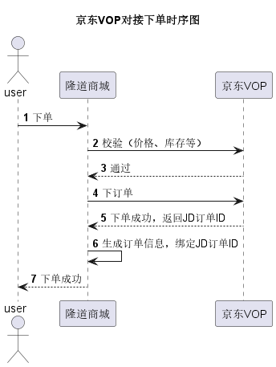

# 简历

## 个人信息

<table align="center" style="word-break: keep-all;word-wrap:break-word;">
<tr>
    <td>姓名</td>
    <td>党未福</td>
    <td>工作年限</td>
    <td>6年</td></tr>
<tr>
    <td>教育经历</td>
    <td>荆楚理工学院(2013.9~2017.7)</td>
    <td>学历</td>
    <td>本科</td></tr>
<tr>
    <td>联系方式</td>
    <td>17319122827</td>
    <td>个人邮箱</td>
    <td>m13886933623@163.com</td>
</tr>
<tr>
    <td>出生日期</td>
    <td>1995.04.08</td>
    <td>性别</td>
    <td>男</td></tr>
</table>

## 工作经历
<table align="center" style="word-break: keep-all;word-wrap:break-word;">
<tr>
    <td>公司名称</td>
    <td>在职起止日期</td>
    <td>职位</td>
<tr>
    <td>北京雷铭置信科技</td>
    <td>2018-6~2020-11</td>
    <td>Java开发</td>
<tr>
    <td>杭州阿优文化科技</td>
    <td>2020-12~2024-2</td>
    <td>研发部副部长</td>
</tr>
<tr>
    <td>浙江网新恒天软件有限公司</td>
    <td>2024-5~2024-6</td>
    <td>项目经理</td>
</table>

## 技术栈

```text
熟练掌握 JavaEE基础知识，掌握多线程、线程池、锁与并发编程、常用设计模式（工厂、代理、单例、策略、责任链等）、反射、自定义注解、泛型等的使用、JVM内存模型、类加载机制、垃圾回收
熟练掌握 TCP、UDP、HTTP以及HTTPS通信协议及其原理
熟练使用 MySQL、Oracle等关系型数据库，熟练使用Redis、MongoDB、ElasticSearch等非关系型数据库
熟练使用 RPC框架Dubbo，了解Dubbo支持的数据通信协议，了解gRPC
熟练使用 RocketMQ，降低服务耦合实现分布式事务的最终一致性，了解RabbitMQ、ActiveMQ、Kafka
熟练使用 Spring、Mybatis、SpringBoot等开源框架，熟悉Spring的IOC、DI、AOP设计思想和自动装配
熟练使用 Docker，能够使用Harbor搭建私有Docker镜像仓库，编写DockerFile打包生成Docker镜像并上传，了解Docker Compose
熟练使用 Linux常用命令、项目部署、熟悉docker、能够使用Docker搭建Maven私服、GitLab私服等
熟知 分布式常见问题及解决方案，如分布式任务调度、服务追踪与调用链路、分布式Session一致性、分布式事务（Seata）、分布式锁、分布式日志收集（ELK）、分布式生成全局ID（雪花算法）
熟悉 Nginx，配置反向代理，实现七层Http和四层tcp负载均衡、故障转移，了解lvs+keepalived+nginx实现高可用负载集群
熟悉 JavaScript、JQuery、HTML+CSS、Ajax、Servlet、Jsp等Web客户端技术
熟悉 JVM常用调优参数及其作用、常用监控工具；能够通过多种方式导出JVM堆快照，并使用MAT分析快照文件定位解决线上问题
熟悉 MySQL主从复制原理、读写分离、分库分表（Mycat），ShardingJdbc、MySQL索引、SQL优化
熟悉 Restfull API开发规范、熟悉三方授权OAuth2协议、JWT协议
熟悉 SkyWalking链路追踪
了解 网络通信技术Socket、NIO、Netty
了解 第三方支付接口、微信公众号对接流程
了解 SpringCloud常用组件注册中心（Eureka|Nacos）、负载均衡器（Ribbon）、服务保护（Hystrix）、网关（Zuul）、
    分布式配置中心（Nacos、Apollo）、链路追踪（Zipkin）、消息总线（Bus）
```

## 项目经历
### 项目名称：广东电力交易统一认证系统（2024年5月~2024年7月）
### 所属企业：浙江网新恒天
### 项目使用技术：Springboot、Docker、Mysql、Redis、OSS、Nginx、Nacos
### 项目简介：
国家为促进电力交易市场化，立项电力交易平台。并将项目拆分为多个子项目外包至不同的单位做研发，
而电力交易统一认证系统是其中的一个子项目，主要负责发电、储能、零售、批发等用户的统一认证管理，
并对接其他单位完成上下游业务。
### 主要职责：
负责陕西区域下的统一认证和门户大屏相关业务开发和维护

### 项目名称：7kid平台(2020年12月~2024年2月)
#### 所属企业：[杭州阿优文化科技有限公司](https://www.66uu.cn/about/introduction)
#### 项目使用技术：
Nacos、Springboot、Mybatis-plus、Redis、MySQL、RocketMQ、Dubbo、Docker、Nginx、Vue、SkyWalking
#### 项目简介：
本项目是为幼儿园提供的幼教与家校互动平台，客户端主要有园所后台、7kid教师端APP、7kid家长端APP、运营后台。
业务模块主要有以下18个，其中我独立全权负责的模块有6个（园务中心、保健中心、家园共育中心、消息中心、访客中心、巡检中心）：
- 园务中心，主要包括以下几点：
  - 园所内年级班级的开班、升班、毕业以及毕业后相关业务数据的归档
  - 教职工的入职、角色岗位分配、日常操作、账号禁用、离职、调岗等管理
  - 幼儿的入园、离园、毕业、调班等一系列的管理

- 消息中心：主要对接第三方消息投递，如短信、推送、邮件、微信公众号消息推送等

- 保育保健中心，主要包括以下几点：
  - 幼儿过敏源、既往史以及各种已知疾病的预防，幼儿日配餐食谱管理等
  - 幼儿身心健康的检查、记录，以国际幼儿健康发育标志作为评判依据对幼儿做一系列的健康评估，以评估结果作为依据对幼儿提出相应的医疗、教育、培养等可行性方案并与家长告知、商榷共同打造优良的教培环境
  -  
  - 记录、统计幼儿的健康情况，从多个维度测评幼儿发育情况并生成对应的统计报表

- 家园共育中心，主要包括以下几点：
  - 班级圈模块是为老师、家长、幼儿互动交流分享生活细节提供的一个在线解决方案 ，幼儿、家长、教师可以在APP端分享家校生活，类似于微信朋友圈一样
  - 亲子活动模块是为老师家长互动教学提供的一个在线解决方案，能够让老师可以在线安排班级活动，指定参与班级，是否需要家长配合提交活动内容。
  - 园所通知模块是为老师提供的一个通知发布在线解决方案，能够让校长、老师在线发布、签收一些通知信息给家长或下属员工
  - 智慧环境模块是为幼儿教培环境提供的一个在线解决方案，能够收集幼儿在校学习生活状态，比如位置信息、心率、睡眠质量、校园监控、门禁识别等，将这些信息在线呈现给家长教师，方便家长老师实时关注幼儿信息
  - 智能相册模块是为幼儿提供的一个人脸识别在线解决方案，能够通过人脸识别让教师、家长上传至系统的一系列照片自动分配至班级相册或个人相册
  - 使用手环、门禁、人脸识别等多种技术手段实现家长智能接送幼儿，家庭管理员可以在线管理接送人员，录入接送人员的人脸等身份信息方便园方快捷核对接送人，打造安全可靠的接送服务
- 访客中心，主要是针对到访人员做的一系列的申请/邀请、到访接待、到/离园信息核对、保安二维码识别核查，打造自主化、自动化访客接待服务
- 巡检中心，主要是为打造安全、优良的教培环境，给园方保卫执勤人员提供的一套巡视巡查任务分配、指派、执行、提交、异常处理系统
- 档案中心 、角色权限中心 教学中心、内容监管中心 财务中心 、帮助中心 、运营管理 、品牌宣传 、系统官网 系统官网 、OA审批、OA审批
- 数字驾驶舱 、智慧环境中心(考勤机、闸机、手环、晨检枪、区角观察、视频监控)、考勤中心(教职工、幼儿考勤)

#### 主要职责：
- 业务需求分析与设计：以版本（22个工作日）为单位，承接版本需求，独立完成版本需求的分析与设计并产出版本任务排期(人/日)
  - 如保育保健中心，从产品出需求->需求评审->实现方案设计->具体实现开发->测试用例评审->项目测试验证->上线验收全程跟进
- 开发任务拆分与跟进：按团队人员情况做任务拆分并持续性跟进任务开发进度，做好风险把控
  - 需求分析完成后对项目做任务拆分，尽可能做到单人日的粒度，最后由项目总监评估版本资源划分开发人员
- 线上问题排查与修复：根据线上错误报警、异常报警、阈值触发报警等报警信息做系统问题的优化、排查与修复
  - 1、线上问题反馈（运营人员）：运营人员通过内部问题反馈APP记录用户问题并下发至开发部做问题排查与修复
  - 2、线上报警中心（监控报警）：人为关注报警中心的错误、异常等报警信息，有问题就找相关模块的负责人做问题排查与修复
- 问题项目重构与优化：对维护性底、扩展性底、服务性能底的项目做整体重构或部分优化,如消息中心的整体重构优化
  - 重构的目的：解决消息中心维护性底、扩展性差、控制粒度较大、交接困难、消息发送失败影响业务事务回滚等问题。
  - 重构的过程：基于代理、工厂、策略、装饰等设计模式对消息中心做重构，使之组件化、插件化，提高其维护性、扩展性，降低交接难易程度、控制粒度等。
  - 重构的结果：控制粒度小（单条消息）、维护性高、扩展新强、消息发送失败仅会响应异常状态码和异常原因，不会中断线程。
#### 项目遇到的问题及其解决方案：
- 健康体测业务数据错误问题
  - 问题原因：MySQL主从延迟导致
  - 排查思路：日志分析->数据分析->逻辑分析->环境分析
  - 修复方案：强制主库查询
- 部分容器实例发生内存溢出现象
  - 问题原因：配置不合理，Http请求头过大导致内存溢出
  - 排查思路：日志分析->数据分析->逻辑分析->环境分析
  - 修复方案：重新评估配置合理性，更改配置值
- 大表查询性能过低问题
  - 优化思路：代码优化->结构优化(表结构、实现结构)->业务优化
  - 分表优化处理
#### 经验与教训
- ThreadLocal 内存泄漏
- Zip压缩流未关闭 内存泄漏

### 项目名称：[隆道商城(2020年6月至2020年11月)](https://sc.longdaoyun.com/)
#### 所属企业：[北京雷铭智信科技有限公司](http://www.leimingtech.com/index.shtml)
#### 项目使用技术：
Apollo、SpringCloud全家桶、Springboot、Mybatis-plus、Seata、Redis、MySQL、ActiveMQ、Docker、Nginx、Vue、k8s、ElasticSearch
#### 项目简介：
本项目是基于京东VOP的ToC和ToB的电商购物平台，核心服务模块有用户、商品、订单、购物车、售后、账期（面向企业）、专属商城（面向企业）。
京东VOP是京东对外的一个面向企业的商城对接解决方案，能够让企业通过VOP对接以租户的形式加入京东平台完成商品信息同步、售卖，类似于构建线下连锁加盟商的一个开放平台。
平台的商品、下单、支付、售后都是以京东为准，一下是下单核心步骤时序图：


#### 主要职责：
- 负责商品模块、专属商城模块和售后模块的功能开发
  其中商品模块的数据来源是从京东商品池以HTTP消息拉取的形式定时同步过来的，并且是双写至MySQL和ES。专属商城是面向企业的一个商品售卖入口，
  其中的订单、钱款都已账期记账的方式支付，实际付款形式采取线下核账销账的形式。
- 负责开发环境、测试环境的搭建，并提供搭建详细文档方便运维人员去甲方实地搭建环境部署项目。
  其中环境的搭建主要包括各个中间件的集群部署，如Redis集群、MySQL集群、ES集群、Docker镜像仓库Harbor、容器编排Kubernetes、
  使用Jenkins自动化打包镜像上传至仓库
- 负责京东VOP的对接，包括商品信息同步、价变信息同步、售后（申请/撤销/拒绝/同意）、物流（待发货/已发货/待揽收/待取件/已签收）、订单的下单、支付、取消等
#### 项目遇到的问题及其解决方案：
- 商品价变消息过多导致消费阻塞
  - 问题原因：消费能力不足导致消息堆积
  - 解决方案：增加消费者，提高消费效率
- 商品超卖问题
  - 应用层优化：分布式锁
  - 业务层优化：预售、限购
  - 服务层优化：及时补货、超卖售后及时沟通与跟进，提供优惠券、退款等售后服务


### 项目名称：[全军武器装备采购信息网(2019年8月至2020年6月)](http://www.weain.mil.cn/)
#### 所属企业：[北京雷铭智信科技有限公司](http://www.leimingtech.com/index.shtml)
#### 项目使用技术：
Spring+SpringMVC+Mybatis+Freemarker+Mysql+Jsp+CDN缓存+CAS单点登录
#### 项目简介：
全军武器装备采购信息网用户分为访客、注册用户和认证用户。其中，访客仅能浏览网站信息，注册用户可进行加入关注和咨询建议等操作，
认证用户配发互联网U盾后，可进行需求对接、产品技术自荐、参与招标、投诉质疑等操作。 网站开设有装备采购需求、政策法规、民参军
指导、采购公告、集中采购、企业名录、产品技术、装备知识、服务指南等栏目，面向社会公众、民营企业、军队装备采购部门、军工集团
等用户全面开放，可实现军队装备采购需求信息发布、企业产品和技术信息推送、军地需求对接、信息动态监测等功能。
#### 主要职责：
- 负责采购需求模块的功能开发，主要是需求的录入、审核、上架、发布，以及采购需求的线上对接、资质审查。
- 负责服务指南栏目功能开发，主要包括一系列的服务指南文章录入、审核、发布、撤销，以及下载中心的各个文档下载管理。
#### 项目遇到的问题及其解决方案：
- CAS单点登录调试困难，链路较长，跳转较多，服务部署后始终无法正常访问
- 问题原因：内网环境，而且防火墙、网关等受限，机房调试困难，导致部署后始终无法正常访问，最终定位是防火墙设置拦击导致CAS-client服务器无法访问CAS-server服务器
- 解决方案：与甲方网络管理员共同分析网络拓扑，结合CAS特有的网络跳转，调整CAS-client配置的根据ST-ticket换取用户信息的CAS-server的IP配置为内网IP
#### 经验与教训：
- 对网络知识了解不够，调试困难重重
- 内网环境开发，要求严格，军事化环境，所有随身携带的设备都必须报备，U盘等设备绝对不允许接入内网，否则以违反军律严肃处理

### 项目名称：[国家军民融合公共服务平台(2018年12月~2019年8月)](http://www.leimingtech.com/caseAll/newsMedia/0b0123bb6b64df0b016b6a1a8d81012c.shtml)
#### 所属企业：[北京雷铭智信科技有限公司](http://www.leimingtech.com/index.shtml)
#### 项目使用技术：
Spring+SpringMVC+Mybatis+Freemarker+Mysql+Jsp+CDN缓存+CAS单点登录+Solr
#### 项目简介：
国家军民融合公共平台是工业和信息化部、财政部于2012年皮批复、2014年建成的国家级的权威政府公共服务平台，主要是打造国务院有关
部委、军队、军工单位和民口企业沟通交流的桥梁和纽带，为深入推进国家军民融合发展，提供更为丰富、便捷的信息服务。网站设有通知公
告、时政要闻、工作动态、需求信息、技术产品、资源共享等栏目。
#### 主要职责：
- 负责通知公告、时政要闻栏目相关业务开发实现，主要是时政要闻的录入、审核、发布以及相关的通知公告的公示，文章的录入、审核等。
#### 项目遇到的问题及其解决方案：
- 要求登录的验证码能够在后台设定字符取值、调整背景模糊度等
- 解决方案：引入市面常用的验证码生成包，并扩展其相关接口，增加自定义字符取值功能、背景模糊度调整功能。

### 项目名称：[CMS内容管理系统(2018年8月~2018年11月)](http://www.leimingtech.com/CMSSolve/list.shtml)
#### 所属企业：[北京雷铭智信科技有限公司](http://www.leimingtech.com/index.shtml)
#### 项目使用技术：
Spring+SpringMVC+Hibernate+Freemarker+Mysql+Solr+Redis+Shiro
#### 项目简介：
本项目是一个集热度、深度、多场景零距离互动于一体的自媒体内容管理系统，主要是在以专业媒体机构为中心传播，
受众对信息是被动接受模式的传媒环境下，给用户提供一种高热度、强交互以内容聚焦为导向的新媒体生态系统。核心
业务功能模块有用户、审核、内容、标签、评论等，基础服务有日志、搜索、通知、权限、认证、消息、邮件、缓存等。
主要是对文章、视频、图片、站点链接、广告等信息做录入、审核、上架、发布、撤销、生成静态页、站点发布等管理操
作。系统由后台录入内容信息，经发布后通过Freemarker生成静态页，再通过Nginx做路由切换控制站点资源访问。
主要核心业务逻辑如下图所示：

#### 主要职责：
- 负责内容管理业务功能开发，其中包括对文章、视频、图片的管理（增删改查导入导出等）
- 负责基于FreeMarker技术的静态页面的生成功能开发

### 项目名称：[中国医学教育题库(2018年6月~2018年7)](https://tk.ipmph.com/exam/a/adminlogin)
#### 开发企业：[北京雷铭智信科技有限公司](http://www.leimingtech.com/index.shtml)
#### 归属单位：[人民卫生电子音像出版社](https://www.pmph.com/main)
#### 项目使用技术：
Nacos、Springboot、Mybatis-plus、Redis、MySQL、RocketMQ、Dubbo、Docker、Nginx、Vue、SkyWalking
#### 项目简介：
主要服务于线上医学类考试，主要业务流程为管理员录入考试题目到题库，配置各类、各科
考试模板（多选、单选、简答等）；包含哪些学科考试内容（内科、外科、泌尿科等等）
生成考卷供线上考试使用。线上考试主要包含功能有监考（屏幕锁定、外网屏蔽、答题、
修改、提交、暂停考试等等）
#### 主要职责：
- 业务bug修复
- 错乱数据维护
## 个人简介
对待工作的优势：
- 责任心强。对自己的工作认真负责，要求尽可能的高质量高效率完成。
- 执行力强。对领导安排的事务无论大小，只要公司需要都会去认真完成。
- 抗压力强。高强度工作压力下仍能够保质保量完成工作。
- 团队协作力强。团队开发过程中，各个岗位的人员需要互相协作取彼之长补己之短，集大家之所长尽善尽美完成工作。

## 项目相关链接
- 企业官网
  - 北京雷铭智信科技有限公司：http://www.leimingtech.com/index.shtml
  - 杭州阿优文化科技有限公司：https://www.66uu.cn/about/introduction
- 项目链接
  - 7kid平台：可以直接去应用市场下载 7Kid教师端APP、7Kid家长端APP
  - 隆道商城：https://sc.longdaoyun.com/
  - 全军武器装备采购信息网：http://www.weain.mil.cn/
  - 国家军民融合公共服务平台：http://www.leimingtech.com/caseAll/newsMedia/0b0123bb6b64df0b016b6a1a8d81012c.shtml
  - CMS内容管理系统：http://www.leimingtech.com/CMSSolve/list.shtml
  - 中国医学教育题库：https://tk.ipmph.com/exam/a/adminlogin

